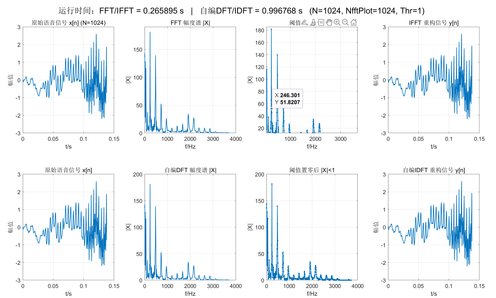

# Simple-Signal-Simulation-on-MATLAB
# README — Intelligent Signal Processing Labs (MATLAB)

> Lab 1: FFT/DFT Implementation  
> Lab 2: IIR Butterworth Low-Pass Filter Design  
> Environment: MATLAB (R2018+ recommended)

---

## Lab 1 — FFT/DFT Thresholding & Signal Reconstruction
**Goal:** Load MATLAB built-in speech signal `mtlb`, compute its spectrum, remove small-magnitude frequency components (|X| < Thr), and reconstruct the signal. Compare **FFT/IFFT** with **self-implemented DFT/IDFT** using `tic/toc`.

**Figures (suggested)**
- Original speech waveform (time domain)
- Magnitude spectrum before thresholding
- Magnitude spectrum after thresholding (|X| < Thr set to 0)
- Reconstructed waveform  
All plotted in one window for comparison (2×4 subplots: FFT/IFFT vs DFT/IDFT).

**Insert figure here**

**Key observations (brief)**
- Larger **Thr** → sparser spectrum but more detail loss in the reconstructed signal.
- **FFT/IFFT** is significantly faster than manual **DFT/IDFT** (O(N log N) vs O(N²)).

---

## Lab 2 — IIR Butterworth Low-Pass Digital Filter (MATLAB)
**Goal:** Design a Butterworth low-pass IIR filter using `buttord` + `butter` with given specs (Fs, fp, fs, Rp, Rs), then plot:
- H(z) coefficients (`b`, `a`)
- Magnitude response in dB
- Phase response (unwrapped)

**Insert figure here**

**Key observations (brief)**
- The magnitude response meets the passband ripple constraint at **fp** and the stopband attenuation at **fs**.
- Butterworth IIR filters typically have **non-linear phase**.
- If MATLAB results differ from hand calculations, common reasons include:
  - Frequency normalization must use **Fs/2**: `Wp=fp/(Fs/2)`, `Ws=fs/(Fs/2)`
  - Bilinear transform frequency warping / pre-warping assumptions
  - Different rounding rules for the minimum filter order
  - Finite frequency grid in `freqz` (increase `Nfft` to reduce reading error)

---

## How to Run
1. Place the scripts in the same folder and set MATLAB **Current Folder** to that directory.
2. Run in MATLAB Command Window:
   - `lab1_fft_dft.m` (Lab 1)
   - `lab2_iir_butter.m` (Lab 2)

---

## Common Issues (quick fixes)
- Wrong normalization: use `/ (Fs/2)` instead of `/ Fs`
- `-Inf` in dB plots: `20*log10(abs(H) + eps)`
- Phase jumps: `unwrap(angle(H))`
